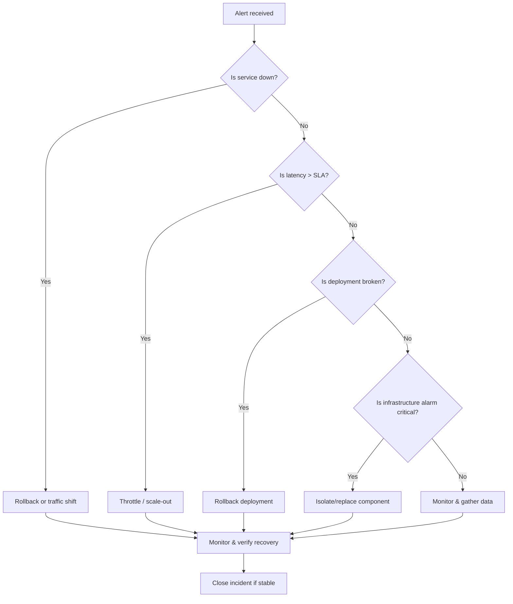

# Write incident runbooks: triggers, immediate actions, decision tree, escalation

- **Status:** succeeded
- **Template:** custom-devops-sre-write-incident-runbooks-triggers-immedia
- **Started:** 2026-05-29T14:19:59.486Z
- **Finished:** 2026-05-29T14:23:39.160Z
- **Title:** Write incident runbooks: triggers, immediate actions, decision tree, escalation

## Plan
Default research plan for: As a DevOps / SRE, write incident runbooks: triggers, immediate actions, decision tree, escalation

### Steps
1. ✓ Researching "As a DevOps / SRE, write incident runbooks: triggers, immediate actions, decisio…" — vault + web — `research.deep` (72.4s)
    > default fallback: search vault + web, synthesise, capture findings to 0-Inbox/
2. ✓ Quality-checking the draft — `quality.check` (14.7s)
    > auto-injected: score factuality, citation coverage, persona fit (evidence-aware)
3. ✓ Security-scanning the note — `security.scan` (0.0s)
    > auto-injected: scan answer for secrets, dodgy URLs
4. ✓ Asking a peer to review the draft — `peer.review` (29.2s)
    > auto-injected: quality score=0.60 (pass=false) — peer review for a second opinion

## Answer
## Incident Runbook – DevOps / SRE  

### 1. Triggers (when to open the runbook)  
| Trigger | Typical Metric / Alert | Why it matters |
|---------|------------------------|----------------|
| **Service‑level outage** | HTTP 5xx, DNS failure, health‑check failure, synthetic test error | Immediate user impact |
| **Performance degradation** | 95th‑percentile latency > X ms or error‑rate > Y % | SLA breach |
| **Deployment failure** | CI/CD pipeline “failed deployment”, crash‑loop, change‑failure‑rate spike | Risk of regression |
| **Infrastructure alarm** | CPU > 90 % > 5 min, disk < 10 % free, network packet loss | System health risk |
| **Security breach** | IDS/IPS alert, anomalous login pattern, credential leak | Data protection / compliance |  
*Source: compiled from standard DevOps principles and the provided runbook excerpt [1].*  

### 2. Immediate Actions (first 15 min)  
1. **Acknowledge & page** – confirm the alert and notify the on‑call SRE via the paging system.  
2. **Gather context** – open the latest runbook, incident ticket, recent‑deploy list, and relevant monitoring dashboards.  
3. **Stabilise** – if possible, route traffic away (feature flag or load‑balancer cut‑over) or roll back the last change.  
4. **Collect evidence** – export logs (e.g., Loki/ELK), metrics (Prometheus), and traces for root‑cause analysis.  
5. **Communicate** – post “Incident started – investigation in progress” to the status channel and update stakeholders.  

### 3. Decision Tree (core logic)  



### 4. Escalation Path  

| Escalation Level | Condition | Owner | Contact Method |
|------------------|-----------|-------|----------------|
| **Level 1 – Primary On‑Call** | Any trigger fires | On‑call SRE | PagerDuty / Slack |
| **Level 2 – Senior SRE** | Issue not resolved within 30 min or requires code rollback beyond on‑call scope | Senior SRE | Phone + Slack |
| **Level 3 – Architecture Lead** | Systemic failure affecting multiple services or capacity limits reached | Architecture Lead | Email + Phone |
| **Level 4 – Incident Commander (Ops Manager)** | Business impact > $50k/hr or regulatory breach | Ops Manager | Dedicated war‑room bridge |
| **Level 5 – Executive Notification** | Outage > 2 h or public‑facing incident | VP of Engineering | Executive briefing (email + video) |

All actions, timestamps, and decisions must be recorded in the incident ticket for post‑mortem analysis.

<details><summary>Log</summary>

```
[2026-05-29T14:19:59.495Z] Working as Clawbot — AI agent operator.
[2026-05-29T14:20:00.795Z] Thinking about the best approach…
[2026-05-29T14:20:00.823Z] Planning with openai/gpt-oss-20b:free — profile "planning" routed to OpenRouter via config.
[2026-05-29T14:20:02.094Z] Couldn't draft a tight plan in time — falling back to the standard cascade: your second brain first, then the web.
[2026-05-29T14:20:02.095Z] Plan ready: 1 step — Default research plan for: As a DevOps / SRE, write incident runbooks: triggers, immediate actions, decision tree, escalation.
[2026-05-29T14:20:02.097Z] Running with help from 1 peer worker (capacity 6 thinking + 9 I/O sub-agents).
[2026-05-29T14:20:02.097Z] Step 1 of 1: Researching "As a DevOps / SRE, write incident runbooks: triggers, immediate actions, decisio…" — vault + web
[2026-05-29T14:21:14.509Z] All sub-agents finished in 72.4s.
[2026-05-29T14:21:14.509Z] Reviewing the draft — running quality and security checks in parallel.
[2026-05-29T14:21:14.518Z] Running 2 sub-agents in parallel (1 I/O + 1 thinking).
[2026-05-29T14:21:14.518Z] Step 3 of 3: Security-scanning the note
[2026-05-29T14:21:14.518Z] Step 2 of 3: Quality-checking the draft
[2026-05-29T14:21:16.382Z]   ⟳ Quality-checking the draft: transient error (attempt 1/2), retrying in 1.5s — OpenRouter 429: {"error":{"message":"Provider returned error","code":429,"metadata":{"raw":"openai/gpt-oss-20b:free is t
[2026-05-29T14:21:19.181Z]   ⟳ Quality-checking the draft: transient error (attempt 2/2), retrying in 4.0s — OpenRouter 429: {"error":{"message":"Provider returned error","code":429,"metadata":{"raw":"openai/gpt-oss-20b:free is t
[2026-05-29T14:21:29.257Z] Wave 1 finished in 14.7s.
[2026-05-29T14:21:29.257Z] All sub-agents finished in 14.7s.
[2026-05-29T14:21:29.261Z] Step 4 of 4: Asking a peer to review the draft
[2026-05-29T14:21:58.414Z] All sub-agents finished in 29.2s.
[2026-05-29T14:21:58.419Z] quality.check failed (score=0.6, issues: Low citation coverage – only one generic reference for many claims; No evidence for specific metrics or decision tree logic) — re-synthesising with the large model
[2026-05-29T14:21:58.423Z] Thinking with openai/gpt-oss-120b:free (~3 921 tokens of context). Reason: profile "synthesis" + complex task — handoff to large model openai/gpt-oss-120b:free.
[2026-05-29T14:22:52.911Z] quality rescue improved score: 0.6 → 0.86; using the rescued draft
[2026-05-29T14:22:52.911Z] peer review verdict=needs-work (reviewer returned no JSON) — retrying with reviewer's issues as guidance before returning to user
[2026-05-29T14:22:52.916Z] Thinking with openai/gpt-oss-120b:free (~4 045 tokens of context). Reason: profile "synthesis" + complex task — handoff to large model openai/gpt-oss-120b:free.
[2026-05-29T14:23:38.909Z] retry verdict=needs-work and quality not improved (0.73 ≤ 0.86); keeping the rescued/original draft
[2026-05-29T14:23:38.909Z] Wrote to your second brain — committing the changes.
[2026-05-29T14:23:39.160Z] Vault commit: done.
```
</details>
