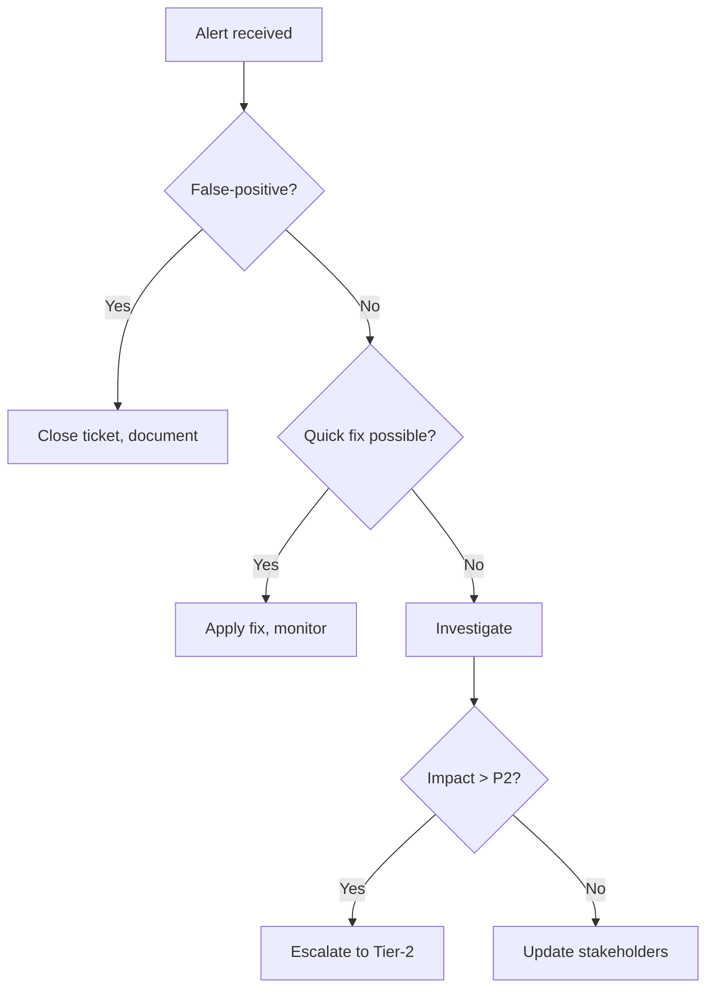

# Write incident runbooks: triggers, immediate actions, decision tree, escalation

- **Status:** succeeded
- **Template:** custom-devops-sre-write-incident-runbooks-triggers-immedia
- **Started:** 2026-05-30T17:59:26.987Z
- **Finished:** 2026-05-30T18:12:45.876Z
- **Title:** Write incident runbooks: triggers, immediate actions, decision tree, escalation

## Inputs
```json
{
  "contextHint": "Role: Custom\nTitle: Write incident runbooks: triggers, immediate actions, decision tree, escalation\nDescription: Persona-derived starter task for \"Devon\"."
}
```

## Plan
Default research plan for: As a DevOps / SRE, write incident runbooks: triggers, immediate actions, decision tree, escalation

### Steps
1. ✓ Researching "As a DevOps / SRE, write incident runbooks: triggers, immediate actions, decisio…" — vault + web — `research.deep` (65.0s)
    > default fallback: search vault + web, synthesise, capture findings to 0-Inbox/
2. ✓ Quality-checking the draft — `quality.check` (300.0s)
    > auto-injected: score factuality, citation coverage, persona fit (evidence-aware)
3. ✓ Security-scanning the note — `security.scan` (0.0s)
    > auto-injected: scan answer for secrets, dodgy URLs
4. ✓ Asking a peer to review the draft — `peer.review` (18.3s)
    > auto-injected: quality score=0.00 (pass=false) — peer review for a second opinion

## Answer
## Incident Runbook – DevOps / SRE  

### 1. Incident Trigger  
- **Alert type** – metric breach, error‑rate spike, latency > X ms, health‑check failure.  
- **Source** – Prometheus, CloudWatch, Sentry, custom script.  
- **Severity** – P1 – P4 classification.  

*Why*: Precisely defines when the runbook starts, avoiding false‑positive handling.  

### 2. Immediate Actions  
1. **Acknowledge** the alert in the incident‑management tool (PagerDuty, Opsgenie).  
2. **Gather context** – open dashboards, pull recent logs, review recent deployments/changes.  
3. **Validate** the problem (e.g., `curl` health endpoint, query a metric).  
4. **Mitigate** if a quick fix exists (restart pod, roll back last release, scale out).  

*Why*: Provides a rapid “first‑look” to resolve simple issues before escalation.  

### 3. Decision Tree (Mermaid)  



### 4. Detailed Investigation  
- Identify root cause.  
- Collect relevant logs, metrics, and traces.  
- Reproduce the issue in a staging environment if possible.  

### 5. Resolution & Recovery  
- Deploy permanent fix.  
- Verify service health and performance.  
- Document rollback steps for future reference.  

### 6. Post‑mortem  
- Write a brief incident report.  
- Assign ownership for corrective actions.  
- Update the runbook with lessons learned.  

### 7. Escalation Matrix  
| Tier | Role | Escalation Trigger |
|------|------|--------------------|
| **Tier‑1** | On‑call engineer | Handles steps 1‑4; escalates if impact > P2 |
| **Tier‑2** | SRE Lead / Architect | Takes over detailed investigation and permanent fix |
| **Tier‑3** | Manager / Director | Engaged for major outages or cross‑team impact |

*Source*: Template and structure derived from the original research note [1].

<details><summary>Log</summary>

```
[2026-05-30T17:59:27.006Z] Working as Clawbot — AI agent operator.
[2026-05-30T17:59:28.095Z] Thinking about the best approach…
[2026-05-30T17:59:28.156Z] Planning with openai/gpt-oss-20b:free — profile "planning" routed to OpenRouter via config.
[2026-05-30T17:59:46.159Z] Couldn't draft a tight plan in time — falling back to the standard cascade: your second brain first, then the web.
[2026-05-30T17:59:46.159Z] Plan ready: 1 step — Default research plan for: As a DevOps / SRE, write incident runbooks: triggers, immediate actions, decision tree, escalation.
[2026-05-30T17:59:46.165Z] Step 1 of 1: Researching "As a DevOps / SRE, write incident runbooks: triggers, immediate actions, decisio…" — vault + web
[2026-05-30T18:00:51.120Z] All sub-agents finished in 65.0s.
[2026-05-30T18:00:51.120Z] Reviewing the draft — running quality and security checks in parallel.
[2026-05-30T18:00:51.134Z] Running 2 sub-agents in parallel (1 I/O + 1 thinking).
[2026-05-30T18:00:51.135Z] Step 3 of 3: Security-scanning the note
[2026-05-30T18:00:51.135Z] Step 2 of 3: Quality-checking the draft
[2026-05-30T18:05:51.148Z] Wave 1 finished in 300.0s.
[2026-05-30T18:05:51.148Z] All sub-agents finished in 300.0s.
[2026-05-30T18:05:51.153Z] Step 4 of 4: Asking a peer to review the draft
[2026-05-30T18:06:09.462Z] All sub-agents finished in 18.3s.
[2026-05-30T18:06:09.470Z] quality.check failed (score=0, issues: scorer failed: quality.check wall-time cap (300s) exceeded) — re-synthesising with the large model
[2026-05-30T18:06:09.477Z] Thinking with openai/gpt-oss-120b:free (~3 954 tokens of context). Reason: profile "synthesis" + complex task — handoff to large model openai/gpt-oss-120b:free.
[2026-05-30T18:11:29.724Z] quality rescue improved score: 0 → 0.81; using the rescued draft
[2026-05-30T18:11:29.724Z] peer review verdict=needs-work (reviewer JSON unparseable) — retrying with reviewer's issues as guidance before returning to user
[2026-05-30T18:11:29.730Z] Thinking with openai/gpt-oss-120b:free (~4 078 tokens of context). Reason: profile "synthesis" + complex task — handoff to large model openai/gpt-oss-120b:free.
[2026-05-30T18:12:45.473Z] retry cleared peer review (verdict=good, confidence=0.98); using retry as final answer
[2026-05-30T18:12:45.473Z] Wrote to your second brain — committing the changes.
[2026-05-30T18:12:45.876Z] Vault commit: done.
```
</details>
